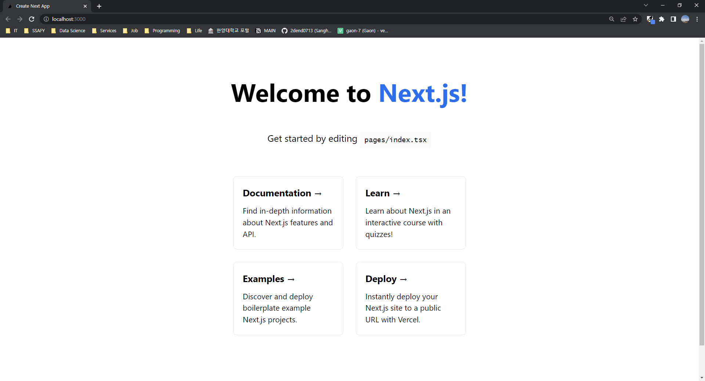

## 🌱 TIL: Next.js

> 작성자: 박상현

<br>

```
💡 처음 만난 Next.js.. 고통받은 나날들의 기록
```

<br>

#### 001. 프로젝트 생성

<br>

```bash
$ npx create-next-app@latest --typescript
```

<br>

타입스크립트 기반 Next.js 프로젝트 생성 명령어를 치면 프로젝트명이 무엇이냐고 물어본다. 프로젝트명을 입력하고 나서 잠시 기다리면 Next.js 프로젝트 생성이 완료된다.

<br>

##### 001.1. development server 실행

```bash
$ npm run dev
```

> bash 창에 `http://localhost:3000`이 출력될 것이다. 해당 url에 접속하면 아래와 같은 초기 화면을 볼 수 있다.

<br>



<br>

<br>

#### 002. Routing

<br>

Next.js는 별도의 라이브러리를 설치하지 않아도 파일 시스템에 기반한 자체 router를 제공한다. `pages` 디렉터리의 파일 구조에 따라 route가 형성되는 방식이다.

<br>

```
page/index.js 👉 '/'
page/home/index.js 👉 '/home'
page/analysis/class.js 👉 '/analysis/class'
```

<br>

routing시키는 방법으로 크게 2가지가 존재한다. (SPA 상에서의 이동과 유사)

<br>

##### 002.1. next/link

> 클라이언트 측에서 라우팅이 가능하게 해주는, `<a>` 태그를 확장한 방식의 Next.js의 컴포넌트이다. `href` 속성을 `<a>` 태그가 아닌 `Link` 컴포넌트에 작성해야 한다.

```react
import Link from 'next/link'

export default function Page() {
    return (
    	<Link href="/recommendation"><a>추천</a></Link>
    )
}
```

<br>

##### 002.2. next/router

> 코드 레벨에서의 routing 방법이다.

<br>

```react
import { useRouter } from 'next/router'

const router = useRouter()
router.push('/recommendation')
```

<br>

<br>
